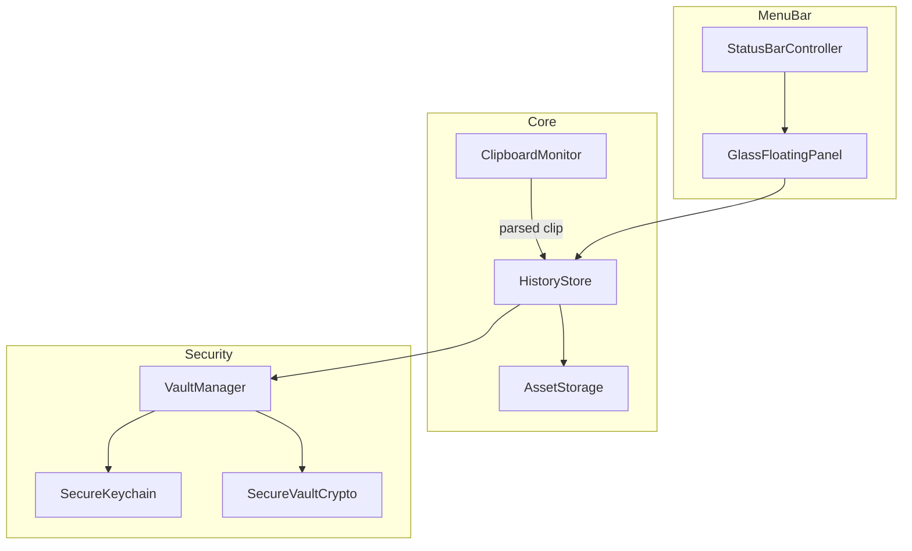

# Appunti Archivio

<p align="center">
  <strong>Clipboard Archive</strong> — a native macOS menu bar app that saves, searches, and protects your clipboard history.
</p>

<p align="center">
  
  
  
  
</p>

<p align="center">
  Developed by <a href="https://github.com/loSpaccaBit"><strong>Francesco Pio Nocerino</strong></a>
</p>

---

## Overview

**Appunti Archivio** lives in the menu bar (no Dock icon) and quietly records everything you copy — text, images, files, and documents. Open the archive with **⌘⇧V**, search instantly, pin important clips, and keep sensitive data in an encrypted vault unlocked with Touch ID.

Built with **SwiftUI**, **Liquid Glass**, and a performance-first architecture: lazy panel loading, debounced persistence, thumbnail caching, and reference-only storage for Finder files (no unnecessary disk duplication).

## Features

| Area | Highlights |
|------|------------|
| **History** | Up to 500 items, full-text search, smart sections (Today, Pinned, per-app, type) |
| **Content** | Text, links, code, screenshots, images, PDFs and documents |
| **Vault** | Local sensitive-data detection, AES-GCM encryption, Touch ID, auto-expiry |
| **Privacy** | Pause saving, configurable retention, optional full-archive encryption |
| **Stack paste** | Multi-select → merge or sequential paste |
| **i18n** | 14 languages including RTL (Arabic), in-app language override |
| **Performance** | ~74 MB RAM at idle, lazy UI, background saves |

## Screenshots

> Add screenshots to `docs/images/` and embed them here before your first GitHub release.

## Requirements

- **macOS 26.0** or later
- **Xcode 17** with the macOS 26 SDK
- [XcodeGen](https://github.com/yonaskolb/XcodeGen) (`brew install xcodegen`)
- Python 3 (for localization tooling)

## Quick Start

```bash
git clone https://github.com/loSpaccaBit/clipboard-archivio.git
cd clipboard-archivio
make install
make open
```

Or step by step:

```bash
make generate   # xcodegen → ClipboardArchivio.xcodeproj
make build      # Release build
make install    # copy to ~/Applications/Appunti Archivio.app
```

## Keyboard Shortcuts

| Shortcut | Action |
|----------|--------|
| **⌘⇧V** | Open / close archive panel |
| **⌘,** | Preferences (panel closes automatically) |
| **⌘F** | Focus search (panel open) |
| **Right-click** menu bar icon | Context menu |

## Architecture



### Project layout

```
ClipboardArchivio/
├── App/                  # App delegate, menu bar, panels, preferences window
├── Models/               # ClipboardItem, categories, filters
├── Services/             # History, vault, parser, localization, assets
├── Views/                # SwiftUI UI (History, Settings, glass chrome)
└── Resources/            # String catalog & master localization JSON

Scripts/
├── i18n/                 # Enterprise localization pipeline
└── performance-test.sh   # RAM/CPU smoke benchmark
```

### Storage model

| Content type | On disk |
|--------------|---------|
| Finder file URLs | Reference only (original path) |
| Pinned / vault files | Copied to Application Support |
| Images / inline data | Always copied |
| Files > 25 MB | Reference only |
| Vault payloads | AES-GCM encrypted (`secure/`) |

Data directory: `~/Library/Application Support/ClipboardArchivio/`

## Localization

14 locales: `en`, `it`, `de`, `fr`, `es`, `pt-BR`, `ja`, `zh-Hans`, `ko`, `nl`, `pl`, `ru`, `ar`, `tr`.

```bash
make i18n       # rebuild strings.master.json + Localizable.xcstrings
make validate   # CI parity check
```

See [Scripts/i18n/README.md](Scripts/i18n/README.md) for translator workflow.

## Development

```bash
make validate    # i18n coverage
make perf        # performance report → Scripts/reports/
make clean       # remove build/
```

### CI

GitHub Actions runs i18n validation and Release builds on every push to `main` and on pull requests.

## Contributing

Contributions are welcome. Please read [CONTRIBUTING.md](CONTRIBUTING.md) before opening a pull request.

## Security

To report a vulnerability privately, see [SECURITY.md](SECURITY.md).

## Changelog

See [CHANGELOG.md](CHANGELOG.md).

## License

[MIT License](LICENSE) — Copyright © 2026 **Francesco Pio Nocerino**

## Author

**Francesco Pio Nocerino**  
GitHub: [@loSpaccaBit](https://github.com/loSpaccaBit)